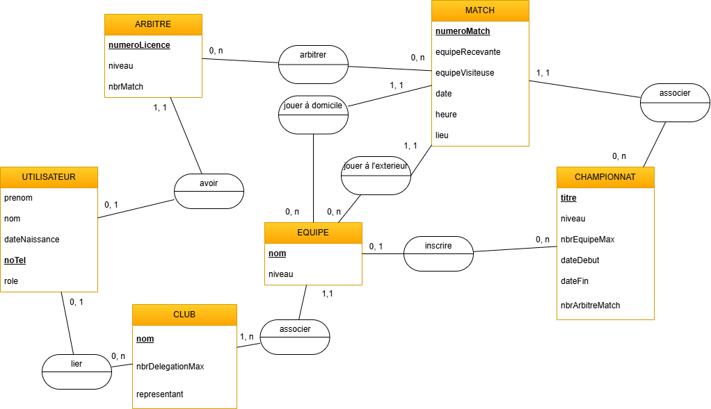
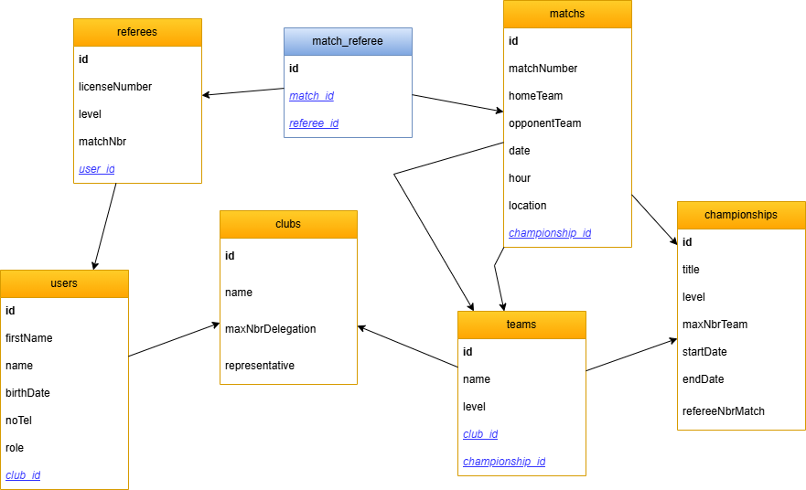

# Présentation MCD-MLD du projet Planar

Le but de mon projet est de réaliser un **MCD** (modèle conceptuel de donnée) puis un **MLD** (modèle logique de donnée) sur la base du projet **planar**. C'est une application pour planifier des arbitres dans des compétitions de sport. 

## MCD

Voici le MCD donc comme je l'ai dit avant c'est basé sur le projet planar. Voilà les types de données de chaques attribut du diagrammes:
- Utilisateur
    - prenom = jusqu'à 23 caractères
    - nom = jusqu'à 23 caractères
    - date de naissance = la date de naissance doit être sous cette forme : jj/mm/aaaa
    - noTel = le numéro de téléphone doit être sous cette forme : +41 78 123 45 67 | + "code-pays" "indicatif régional" "numéro"
    - role = un utilisateur peut avoir un rôle à la fois et peut être : Admin-Arbitre-Représentant de club ou juste aucun rôle
- Arbitre
    - numero de licence = Le numéro de licence est composé d'un préfixe "AR" et d'un numéro aléatoire composé de 5 chiffres qui suit. Exemple : AR12345
    - niveau = Le niveau auquel l'arbitre exerce comme par exemple : si c'est du pro ou semi-pro, premiere, seconde ligue, etc...
    - nbrMatch = ici doit y avoir le nombre de match que l'arbitre en question **doit** arbitré
- Match
    - numeroMatch = Le numéro de match est composé d'un préfixe "MATCH" et de l'année de l'événement ou du championnat et puis du numéro séquentiel du match de la saison par exemple : MATCH-2025-001
    - equipeRecevante = Le nom de l'équipe dites "domicile" même si elle peut jouer sur un terrain que le sien. Le nom ne doit pas dépassé 23 caractères.
    - equipeVisiteuse = Le nom de l'équipe visiteuse. Le nom ne doit pas dépassé 23 caractères.
    - date et heure = la date et l'heure doivent être sous cette forme jj/mm/aaaa heure:minute par exemple : 14.03.2025 14:40
    - lieu = Le nom du lieu où le match se déroule. Pas plus que 23 caractères
- Championnat
    - titre = Le titre de du championnat par exemple : ligue 1 ; ligue 2 ; National 1 ; etc... jusqu'à 23 caractères 
    - niveau = Le niveau du championnat si c'est du pro ou semi-pro, premiere, seconde ligue, etc...
    - nbrEquipeMax = Le nombre d'équipe maximum qu'un championnat peut contenir
    - dateDebut = la date de doit être sous cette forme : jj/mm/aaaa
    - dateFin = la date doit être sous cette forme : jj/mm/aaaa
    - nbrArbitreMatch = Le nombre d'arbitre par match du championnat
- Equipe
    - nom = Le nom de l'équipe, le nom ne doit pas dépassé 23 caractères
    - niveau = Dans quel niveau cette équipe joue par exemple : 
- Club
    - nom = Le nom du club, Le nom ne doit pas dépassé 23 caractères
    - nbrDelegationMax = Le nombre maximum de delegations qu'un club puisse avoir
    - representant = Le nom du représentant, maximum 23 caractères

## MLD

Voici donc le MLD correspondant au projet Planar, basé sur le MCD que nous avons vu précédemment. Ci-dessous, les types de données associés à chaque attribut du diagramme :

- User
    - id
    - firstName = string
    - Name = string
    - birthDate = date (the birth date should be in the format: dd/mm/yyyy)
    - noTel = string (the phone number should be in this format: +41 78 123 45 6 | + "country-code" "area-code" "number")
    - role = string
    - club_id
- Referee
    - id
    - licenseNumber = integer
    - level = string
    - numberOfMatches = integer
    - user_id
- Match
    - id
    - matchNumber = integer
    - homeTeam = string
    - awayTeam = string
    - dateTime = datetime (the date and time should be in the format: dd/mm/yyyy hour:minute)
    - location = string
    - Championship
    - title = string
    - level = string
    - maxNumberOfTeams = integer
    - startDate = date (the date should be in the format: dd/mm/yyyy)
    - endDate = date (the date should be in the format: dd/mm/yyyy)
    - numberOfRefereesPerMatch = integer
    - championship_id
- Team
    - id
    - name = string
    - level = string
    - club_id
    - championship_id
- Club
    - id
    - name = string
    - maxNumberOfDelegation = integer
    - representative = string

## Script de base de données

-- Création de la table "User"
CREATE TABLE User (
    id INT AUTO_INCREMENT PRIMARY KEY,
    firstName VARCHAR(100) NOT NULL,
    lastName VARCHAR(100) NOT NULL,
    birthDate DATE NOT NULL,
    noTel VARCHAR(20) NOT NULL,
    role VARCHAR(50) NOT NULL
);

-- Création de la table "Referee"
CREATE TABLE Referee (
    id INT AUTO_INCREMENT PRIMARY KEY,
    licenseNumber INT NOT NULL,
    level VARCHAR(50) NOT NULL,
    numberOfMatches INT NOT NULL,
    userId INT,
    FOREIGN KEY (userId) REFERENCES User(id)
);

-- Création de la table "Match"
CREATE TABLE Match (
    id INT AUTO_INCREMENT PRIMARY KEY,
    matchNumber INT NOT NULL,
    homeTeam VARCHAR(100) NOT NULL,
    awayTeam VARCHAR(100) NOT NULL,
    dateTime DATETIME NOT NULL,
    location VARCHAR(200) NOT NULL
);

-- Création de la table "Championship"
CREATE TABLE Championship (
    id INT AUTO_INCREMENT PRIMARY KEY,
    title VARCHAR(100) NOT NULL,
    level VARCHAR(50) NOT NULL,
    maxNumberOfTeams INT NOT NULL,
    startDate DATE NOT NULL,
    endDate DATE NOT NULL,
    numberOfRefereesPerMatch INT NOT NULL
);

-- Création de la table "Team"
CREATE TABLE Team (
    id INT AUTO_INCREMENT PRIMARY KEY,
    name VARCHAR(100) NOT NULL,
    level VARCHAR(50) NOT NULL
);

-- Création de la table "Club"
CREATE TABLE Club (
    id INT AUTO_INCREMENT PRIMARY KEY,
    name VARCHAR(100) NOT NULL,
    maxNumberOfDelegation INT NOT NULL,
    representative VARCHAR(100) NOT NULL
);

-- Relations entre les tables (Table de jonction pour les relations plusieurs à plusieurs)

-- Association entre Match et Championship
CREATE TABLE Match_Championship (
    matchId INT,
    championshipId INT,
    FOREIGN KEY (matchId) REFERENCES Match(id),
    FOREIGN KEY (championshipId) REFERENCES Championship(id),
    PRIMARY KEY (matchId, championshipId)
);

-- Association entre Match et Referee
CREATE TABLE Match_Referee (
    matchId INT,
    refereeId INT,
    FOREIGN KEY (matchId) REFERENCES Match(id),
    FOREIGN KEY (refereeId) REFERENCES Referee(id),
    PRIMARY KEY (matchId, refereeId)
);

-- Association entre Team et Club
CREATE TABLE Team_Club (
    teamId INT,
    clubId INT,
    FOREIGN KEY (teamId) REFERENCES Team(id),
    FOREIGN KEY (clubId) REFERENCES Club(id),
    PRIMARY KEY (teamId, clubId)
);

**Work in progress**

