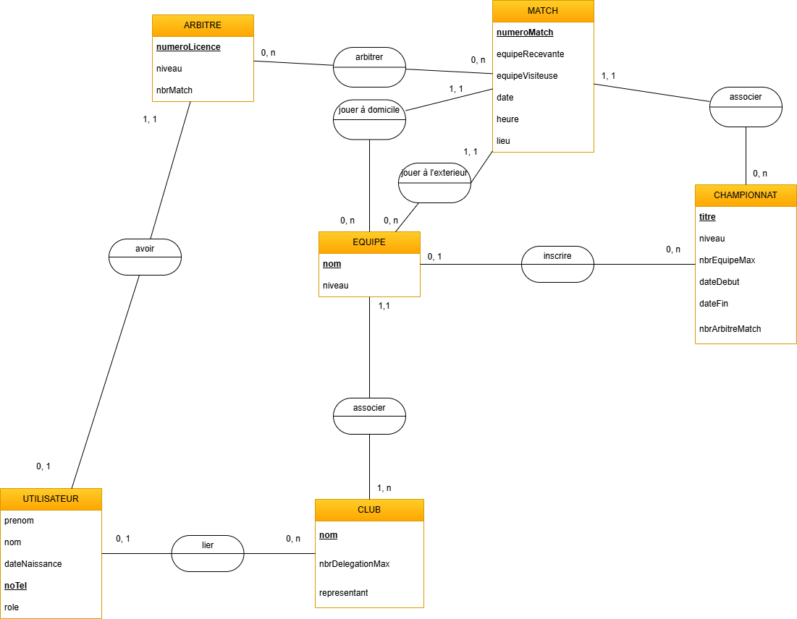

# Présentation MCD-MLD du projet Planar

Le but de mon projet est de réaliser un **MCD** (modèle conceptuel de donnée) puis un **MLD** (modèle logique de donnée) sur la base du projet **planar**. C'est une application pour planifier des arbitres dans des compétitions de sport. 

Je fais ce projet afin de remédier à un ancien projet qui était sur le thème des bases de données auquel j'ai eu un NA car le rapport n'était pas terminé. Ce projet-ci a donc pour but de compenser les lacunes.

## MCD
Le modèle conceptuel de donnée est une représentation graphique qui permet d'illustrer les liens entre les différents éléments. Le MCD vient de la méthode **Merise**. Ca va servir pour plus tard à réaliser le modèle logique de donnée qui lui, va être plus déstiné à des développeurs.

Voici le MCD donc comme je l'ai dit avant c'est basé sur le projet planar. Voilà les types de données de chaques attribut du diagrammes:
- Utilisateur
    - prenom = string
    - nom = string
    - date de naissance = date (la date de naissance doit être sous cette forme : jj/mm/aaaa)
    - noTel = string (le numéro de téléphone doit être sous cette forme : +41 78 123 45 6 | + "code-pays" "indicatif régional" "numéro")
    - role = string
- Arbitre
    - numero de licence = integer
    - niveau = string
    - nbrMatch = char
- Match
    - numeroMatch = Char
    - equipeRecevante = string
    - 